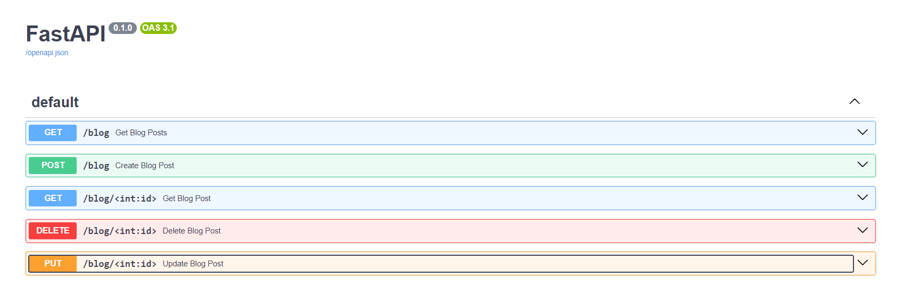
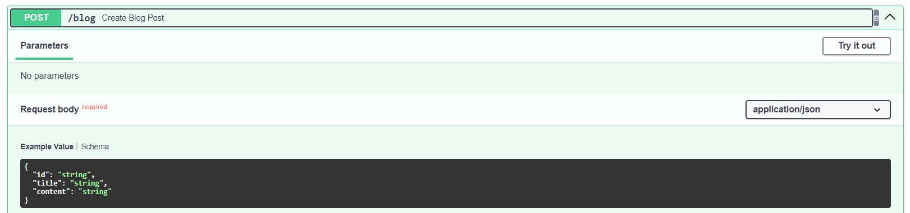
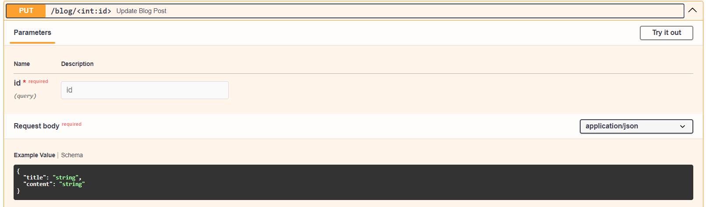

# 2024-M10-P2



## Alterações Realizads

1. Adição do Docker file na pasta src, para a criação de uma imagem docker com o projeto.
2. Adição do arquivo na raiz do repo `docker-compose.yml` para a criação do container do `Nginx` e do container do projeto.
3. Criação da pasta `nginx` na pasta `src`, com o arquivo de configuração do `Nginx` para o projeto.
4. Criação da pasta `collections` na razi do repo, com o arquivo de configuração do `Insomnia` para o projeto.
5. Ajuste no arquivo `main.py`, tirando anteriormente de flask e adicionando o FastAPI.
6. Criação da pasta logs na pasta `src`, para armazenar os logs do projeto.
7. Adição do arquivo `requirements.txt` na raiz do repo, com as dependências do projeto.

## Rotas

- [GET] `/blog` - Retorna todos os post do blog.
- [POST] `/blog` - Cria um novo post no blog.
- [GET] `/blog/{id}` - Retorna um post específico do blog.
- [PUT] `/blog/{id}` - Atualiza um post específico do blog.
- [DELETE] `/blog/{id}` - Deleta um post específico do blog.

## Schemas

- **Post:** Usado para a criação de posts no blog.
  - `id`: ID do post.
  - `title`: Título do post.
  - `content`: Conteúdo do post.


  
- **PostItems:** Usado para a criação de posts no blog.
  - `title`: Título do post.
  - `content`: Conteúdo do post.
  


*NOTA: Para a criação dos Schemas, foram criadas novas classes no arquivo `main.py`, utilizando a biblioteca `pydantic`.*

   
## Como rodar

1. Após clonar o repositório, entre na pasta do projeto.
2. Agora, crie um arquivo `app.log` na pasta `src/logs`. Garanta que o arquivo está vazio.
3. Execute o comando `docker-compose up --build` para criar a imagem do projeto e do `Nginx`.
4. Acesse o endereço `http://localhost:3000/docs` para ver o projeto rodando pelo `Swagger`.
5. Para testar as rotas, acesse o endereço `http://localhost:3000/docs` e clique em `POST` e depois em `Try it out`.

## Rotas do Nginx

```nginx
    location /docs {
        proxy_pass  http://server/;
    }

    location /server {
        proxy_pass http://server/;
    }
```